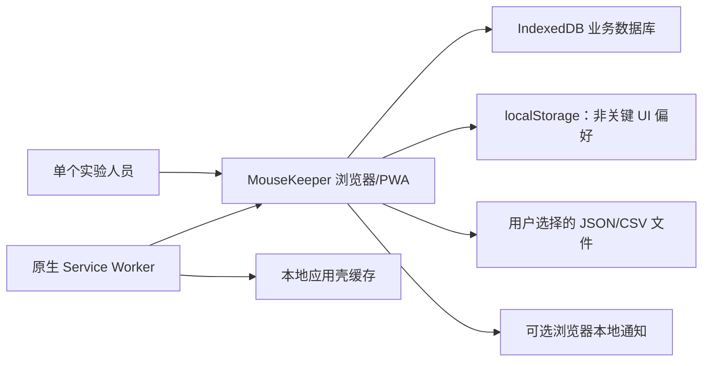
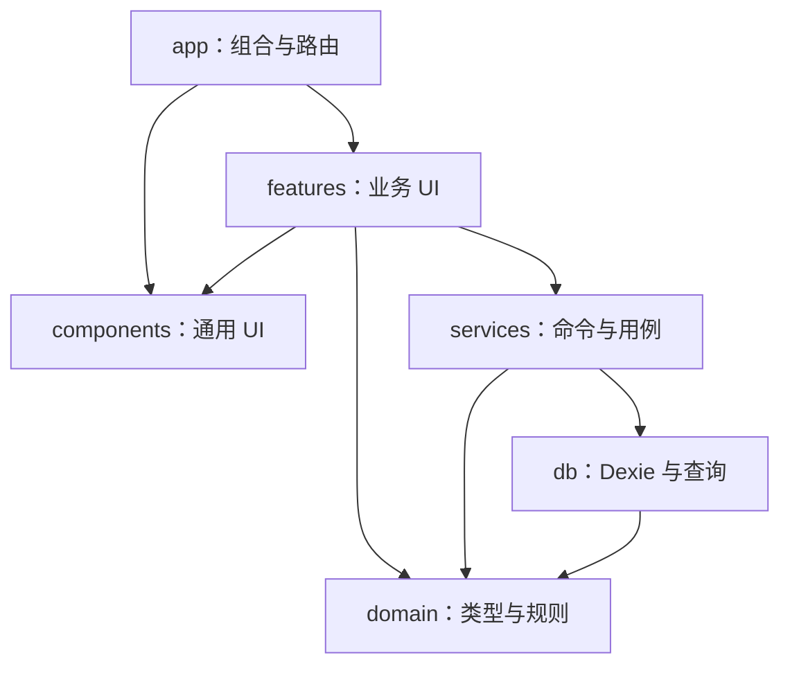

# MouseKeeper 架构说明

## 文档状态

本文定义 MouseKeeper v1 的目标架构和模块边界，不代表所有模块已经实现。

静态检查基线为 2026-07-30 23:46 CST、Git HEAD
`ffddb3267fdca9f1b90c4dd4cfa91ed8c1498be8`。该基线已经具备 React/Vite
最小应用壳、集中应用配置、原生 Web App Manifest、原生 Service Worker 和测试工具链；
业务路由、Dexie schema、服务命令及核心业务页面在该基线中尚未实现。

文中的关键词：

- **已存在**：在上述基线中可由文件静态确认。
- **设计契约**：v1 实现必须遵守，但仍需代码和测试证明。
- **待验证**：必须通过运行时、真实浏览器或性能测试确认。

## 1. 系统目标

MouseKeeper 是面向单个实验人员的本地优先小鼠管理 PWA：

- 小鼠、笼位、繁育、实验、事件、体重和任务等业务数据保存在浏览器 IndexedDB；
- 无登录、后端、云数据库、实时协作或远程账号；
- 在 Windows、macOS 桌面浏览器上承担完整工作流，在手机上承担查找和常用记录；
- 安装后可离线打开应用壳，并在离线状态继续访问本地业务数据；
- 完整 JSON 备份是灾难恢复格式，CSV 是交换格式，不是数据库替代品。

本地优先不等于自动备份。清除浏览器站点数据、浏览器配置损坏或磁盘故障仍可能导致
数据丢失，产品必须持续如实提醒用户导出备份。

## 2. 当前技术基线

以下内容来自 `package.json`、配置和源码静态检查：

| 范畴 | 当前选择 | 状态 |
|---|---|---|
| UI | React 19、TypeScript 5.9、Tailwind CSS 4 | 已存在最小壳 |
| 构建 | Vite 7，Node `>=20.19` | 已配置 |
| 路由 | Wouter 3 | 依赖已声明，业务路由待实现 |
| 本地数据 | Dexie 4、dexie-react-hooks | 依赖已声明，schema 待实现 |
| 表单校验 | React Hook Form、Zod、resolvers | 依赖已声明，业务表单待实现 |
| UI 原语 | Radix Dialog/AlertDialog/Select/Tabs 等、Lucide | 依赖已声明 |
| CSV | Papa Parse | 依赖已声明，导入导出待实现 |
| 单元/组件测试 | Vitest、Testing Library、jsdom、fake-indexeddb | 已配置；仅有最小 App 测试 |
| E2E | Playwright，桌面 Chromium 与 Pixel 7 项目 | 已配置；基线中尚无 `e2e/` 用例 |
| PWA | 本地 manifest + 原生 Service Worker | 已有最小实现；离线、更新、安装待验证 |

应用名称、版本、数据库名和 schemaVersion 已集中在 `src/config/app.ts`。业务代码不得再
散落硬编码产品名或数据库名。

## 3. 系统上下文



约束：

- IndexedDB 是业务数据唯一持久化存储；localStorage 只保存主题、表格密度等非关键偏好。
- Service Worker 缓存静态应用壳，不复制或代理 IndexedDB 业务事实。
- 通知权限只在用户主动开启提醒时请求；通知不可用时，应用内任务仍须完整工作。
- 运行时不依赖远程字体、远程图标、分析脚本或持续在线服务。
- 文件导入和下载是用户设备上的本地 I/O；应用不能声称备份文件已经安全落盘，除非浏览器
  API 能确认保存成功。

## 4. 分层与依赖方向

仲裁确定的目标目录如下：

```text
src/
  app/             应用组合、路由、providers、错误边界
  config/          产品名、版本和稳定配置
  domain/          实体、枚举、Zod schema、纯业务规则
  db/              Dexie 数据库、v1 stores、查询、migration、完整性扫描
  services/        事务命令、备份恢复、CSV、示例数据
  features/        按 dashboard/mice/cages/... 组织页面、表单和查询 hooks
  components/      无业务写入能力的通用 UI 原语与应用壳
  test/            共享测试环境、fixture 和 helper
e2e/               真实浏览器端到端用例
```

当前基线尚未建立多数目标目录；这是目标结构，不是现状清单。



依赖规则：

1. `domain` 不依赖 React、Dexie、浏览器 UI 或具体页面。
2. `db` 可依赖 `domain`，但不得依赖 `features`。
3. `services` 组合领域校验与数据库事务，是业务写入的唯一入口。
4. React 页面、组件和 hooks 不得直接调用 `db.table.put/update/delete/clear`。
5. 读取应通过命名查询或 repository/query adapter；页面不散落 Dexie 索引细节。
6. `components` 不导入具体业务 feature 或 service。
7. 备份、CSV 和示例数据复用同一组 Zod schema 与 service 规则，不建立宽松的旁路写入。

## 5. 写入命令契约

所有业务修改以服务层命令表达。建议的命令形状为：

```ts
interface CommandEnvelope<TPayload> {
  operationId: string
  expectedRevision?: number
  warningAcknowledgements?: string[]
  payload: TPayload
}
```

- `operationId` 由 UI 第一次提交时生成，重试保持不变；`ActivityLog.operationId` 唯一，
  从数据层阻止双击、重试和多标签页导致的重复副作用。
- 编辑命令携带 `expectedRevision`。revision 不一致时返回冲突，不静默覆盖。
- 服务第一次可返回结构化 warning code；用户确认后用同一 `operationId` 和确认代码重试。
- 二次提交必须在事务内重新读取现状。容量或 revision 变化会使旧确认失效。
- 表单禁用提交按钮和防抖只是体验措施，不能代替唯一键、revision 和事务重查。

主要专用命令包括 `moveMouse`、`changeMouseStatus`、
`createLitterWithOffspring`、`assignMouseToExperiment`、`recordWeight`、
`softDeleteMouse` 和 `restoreBackup`。终结状态、当前笼位、父母关系不能通过通用
`updateMouse` 绕过专用规则。

完整事务边界见 [数据模型说明](./data-model.md#7-事务边界)。

## 6. 读取、派生状态与 UI 状态

- IndexedDB 中保存业务事实和需要进入备份的业务设置。
- 年龄、周龄、笼位占用、逾期状态和仪表盘计数是派生结果，不作为第二份独立事实维护。
- `Mouse.currentCageId` 是为 5,000 条列表查询保留的只读投影；活动
  `CageAssignment` 才是权威来源。投影只能在转笼事务中同步，并可由完整性扫描修复。
- React Hook Form 管理表单草稿；路由参数和可分享筛选进入 URL；临时弹窗、菜单和选择状态
  留在组件/feature 内。
- v1 不引入重量级全局状态库。若未来需要共享状态，应先证明它不是 Dexie 查询、URL 或局部
  state 能表达的内容。
- 保存视图只保存筛选、排序、列和密度配置，不保存查询结果快照。

## 7. 业务模块

桌面一级入口为：

1. 总览；
2. 小鼠；
3. 笼位；
4. 繁育；
5. 实验；
6. 记录；
7. 任务；
8. 数据与安全；
9. 设置。

移动底栏固定为总览、小鼠、笼位、任务和更多。回收站属于“数据与安全”，不扩大一级导航。

跨模块事实：

- 小鼠状态是单值操作状态，不是实验或繁育关系的替代品；
- 活跃实验成员从 `ExperimentAssignment` 计算；
- 活跃繁育成员从 `BreedingPair` 计算；
- 体重数值和趋势以 `WeightRecord` 为权威，同时在同一事务维护只读的
  `MouseEvent(type=weight)` 时间线投影；
- `ActivityLog` 记录应用操作，`MouseEvent` 记录实验对象发生的业务事件。

## 8. PWA 与无后端策略

仲裁拒绝了 `vite-plugin-pwa`/Workbox 依赖链，v1 采用：

- `public/manifest.webmanifest`；
- `public/sw.js` 原生 Service Worker；
- 仅生产环境在 `src/main.tsx` 注册；
- 同源静态资源和导航壳缓存；
- IndexedDB 继续由页面应用直接访问。

设计契约：

- 首次在线加载成功后，离线导航应回退到缓存的 `index.html`。
- 带哈希的构建资产可以运行时缓存；旧 `mousekeeper-shell-*` cache 在 activate 时清理。
- Service Worker 更新不能与 Dexie schema 升级失配。旧标签页收到
  `versionchange` 后必须关闭数据库连接并提示刷新。
- v1 不实现后台同步、服务器推送或远程冲突合并。
- “可安装”“可离线”和“更新后仍可读旧数据”都必须在生产构建和真实浏览器中验证。

当前 `sw.js` 是最小缓存实现。缓存新构建资产、离线重载、更新切换和安装提示尚无验收证据，
不能标记为完成。

## 9. 错误与恢复边界

- 页面级错误边界处理渲染异常，但不得把数据库错误转换成“成功”。
- 写入失败时保留表单输入和当前页面上下文，并提供可执行的重试或导出诊断。
- 数据库打开或 migration 失败时进入只读恢复页；绝不自动删除旧数据库。
- `blocked` 应提示关闭其他 MouseKeeper 标签页，不能无限显示加载。
- `QuotaExceededError`、`ConstraintError`、`AbortError` 和 revision 冲突使用不同的错误码。
- 完整恢复在事务外完成文件限制、解析、Zod、checksum、版本迁移和引用审计；只有已验证数据
  才进入覆盖全部 16 表的单一 Dexie `rw` 事务。
- 历史引用读取返回“已解析 / 已软删除 / 缺失”三态，不把所有异常都显示为空。

## 10. 数据安全与隐私边界

- 默认不发送任何业务数据到网络。
- 不把备份、真实 CSV、浏览器数据库导出或用户实验数据提交到 Git。
- 导入文本按纯文本渲染，不能使用未净化的 HTML。
- CSV 导出对可能被表格软件解释为公式的单元格进行防护。
- checksum 用于检测意外损坏，不等于签名、加密或来源真实性。
- ActivityLog 不复制整段长备注的 before/after，避免隐私和存储膨胀。
- PWA 缓存只包含应用资产，不缓存用户导入文件或下载的备份。

## 11. 架构验收

v1 发布前至少要有证据证明：

- feature 页面没有绕过 service 直接写 Dexie；
- 16 张表全部进入 v1 schema、完整备份和恢复事务；
- 转笼、终结状态、创建后代、实验换组、体重双写、活动对象软删除均通过故障注入测试；
- 相同 operationId 重试不产生重复记录，revision 冲突不静默覆盖；
- 刷新、浏览器重启和 PWA 更新后业务数据仍存在；
- 生产构建可安装并在断网后重载；
- 数据库 migration 被旧标签页阻塞、失败或配额不足时不清空旧库；
- 5,000 小鼠、1,000 笼位、50,000 事件、20,000 体重记录下没有常用路径
  O(n²) 行为；
- Windows、macOS 桌面和手机宽度的核心流程经过实际验证。

当前文档工作没有执行上述验收。具体测试矩阵见
[测试与验收说明](./testing.md)。
