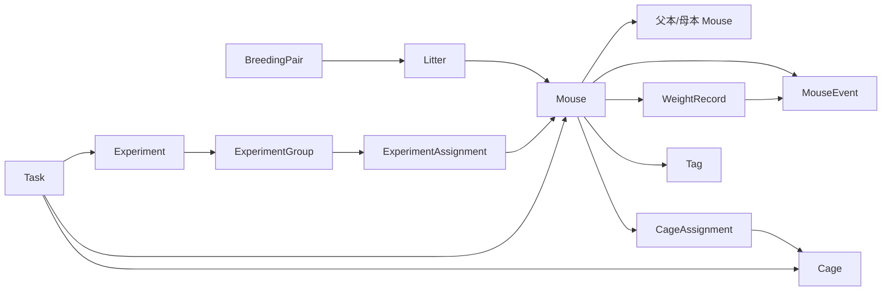

# MouseKeeper 数据模型说明

## 文档状态

本文是初始架构仲裁确定的 v1 数据契约。静态检查基线中 Dexie 依赖和
`APP_CONFIG.schemaVersion = 1` 已存在，但 16 表 schema、Zod 实体、事务服务和完整性扫描
尚未实现或验证。下述字段、索引和事务均为实现必须满足的设计，不是完成声明。

## 1. 版本与基础类型

四种版本必须分开：

| 名称 | v1 初始值 | 用途 |
|---|---:|---|
| `DB_VERSION` | `1` | Dexie `db.version(n)` 的物理数据库版本 |
| `schemaVersion` | `1` | 业务记录及备份 payload 的结构版本 |
| `backupFormatVersion` | `1` | 备份外层信封格式版本 |
| `revision` | 每条记录从 `1` 开始 | 乐观并发；每次更新递增 |

`appVersion` 当前为 `0.1.0`，用于诊断和兼容性提示，不能代替上述任一版本。

类型约定：

- 主键为应用生成的不可变字符串 ID，优先 `crypto.randomUUID()`；
- 自然日为严格 `YYYY-MM-DD`，不经 UTC midnight 转换；
- 时间点为 UTC ISO-8601 instant；
- 带用户输入时间的事件同时保存本地日期、可选时间、时区和排序 instant；
- 年龄和周龄从出生日期计算，不落库；
- 体重保留原单位，并保存标准化克值供比较。

## 2. 公共存储字段

除实体专有字段外，16 个实体都应具有一致的生命周期与审计字段：

```ts
interface StoredEntity {
  id: string
  schemaVersion: number
  revision: number
  createdAt: string
  updatedAt: string
  deletedAt: string | null
  deletedFlag: 0 | 1
  origin: 'user' | 'sample' | 'import' | 'system'
  sampleBatchId?: string
  importBatchId?: string
  custom?: Record<string, JsonValue>
}
```

约束：

- `deletedAt === null` 当且仅当 `deletedFlag === 0`；
- IndexedDB 索引不使用 boolean 或 `null` 键；可选唯一键不参与索引时必须为
  `undefined`/缺失；
- `custom` 仅允许经过 Zod 限制的 JSON 值，并限制深度、键数和序列化大小；
- 示例来源和批次 ID 传播到全部关联记录，不能只标记 Mouse。

## 3. 16 个实体

| # | 表 / 实体 | 关键字段 | 职责与约束 |
|---:|---|---|---|
| 1 | `mice` / Mouse | 耳标、实验编号、别名、品系、基因型、性别、出生日期、父母、窝、状态、来源、毛色、备注、标签、`currentCageId` 投影 | 小鼠主档；活动规范化耳标硬唯一；年龄不落库 |
| 2 | `cages` / Cage | 笼位编号、房间、架位、最大容量、主要品系、用途、状态、备注 | 活动规范化笼号硬唯一；当前成员和占用数不作为可编辑字段 |
| 3 | `cageAssignments` / CageAssignment | `mouseId`、`cageId`、开始/结束时间、活动标志、原因、历史快照 | 一个连续驻笼区间；每只鼠至多一个活动 assignment |
| 4 | `breedingPairs` / BreedingPair | 父本、母本、合笼/分笼日期、预计生产、状态、确认代码 | 父母角色固定；重复活动组合受唯一键约束 |
| 5 | `litters` / Litter | 组合、窝号、父母快照、出生日期、出生数、存活数、断奶日期 | 后代通过 `Mouse.litterId` 指回，不维护双向 offspring 数组 |
| 6 | `experiments` / Experiment | 编号、名称、描述、起止日期、状态、干预、剂量、频率、负责人、备注 | 结束/软删除不删除分组、分配和事件历史 |
| 7 | `experimentGroups` / ExperimentGroup | 实验、名称、对照/实验/自定义类型、互斥集合、干预字段 | 组必须属于一个实验；组名在活动实验内唯一 |
| 8 | `experimentAssignments` / ExperimentAssignment | 小鼠、实验、组、加入/退出时间、原因、活动标志、历史快照 | 阻止重复组成员及同一互斥集合中的第二个活动分配 |
| 9 | `mouseEvents` / MouseEvent | 类型、发生日期/时间/时区、关联小鼠/笼位/实验、标题、描述、版本化 payload、来源 | 统一只读时间线；系统投影通过来源命令维护 |
| 10 | `weightRecords` / WeightRecord | 小鼠、唯一 `eventId`、测量时间、数值、单位、克值、备注、异常确认 | 体重权威事实；与 weight event 一对一、同生命周期 |
| 11 | `tasks` / Task | 标题、到期日/时间、对象引用、优先级、状态、备注、完成时间 | 对象引用可选；对象删除后任务仍可读和完成 |
| 12 | `tags` / Tag | 名称、规范名、活动唯一键、颜色、描述 | 删除时从活动 Mouse 显式移除并记录 tag-change |
| 13 | `activityLogs` / ActivityLog | 唯一 `operationId`、动作、主对象、引用键、摘要、变更字段、确认代码 | 每个用户命令一条；原则上追加后不可编辑 |
| 14 | `savedViews` / SavedView | scope、名称、queryVersion、filters、sort、columns、lastUsedAt | 保存查询配置，不保存数据快照或可执行函数 |
| 15 | `appSettings` / AppSettings | 固定 ID、应用名、locale、时区、周起始、容量/体重阈值、通知偏好、数据库实例 ID | 需要进入备份的业务设置；主题可留 localStorage |
| 16 | `backupMetadata` / BackupMetadata | backup ID、种类、状态、格式/schema/app 版本、时间、文件名、checksum、计数、错误 | 只存备份操作元数据，不在主库保存完整备份 Blob |

确切 TypeScript 字段、Zod schema、Dexie store 字符串和备份 key 必须使用同一命名；
其中任何一处变化都要经过 migration 和 fixture。

## 4. 关系



IndexedDB 不提供外键。创建、更新、删除、恢复和导入必须在服务事务内重新读取引用对象，
确认其存在、未删除、revision 和业务状态均符合规则。

读取引用返回三态：

```ts
type RelationResult<T> =
  | { state: 'resolved'; value: T }
  | { state: 'deleted'; value: T }
  | { state: 'missing'; id: string }
```

历史对象软删除时仍可用快照显示；真正缺失必须显示损坏警告，不能静默当作空值。

## 5. 权威事实与投影

| 用户看到的事实 | 权威来源 | 可重建投影 / 展示 |
|---|---|---|
| 当前笼位 | 唯一活动 `CageAssignment` | `Mouse.currentCageId` |
| 笼位当前数量 | 活动 `CageAssignment` 查询 | 仪表盘/列表计数 |
| 活跃实验成员 | 活动 `ExperimentAssignment` | Mouse 状态不是依据 |
| 活跃繁育成员 | 活动 `BreedingPair` | Mouse 状态不是依据 |
| 体重与趋势 | `WeightRecord` | `MouseEvent(type=weight)` 时间线投影 |
| 年龄与周龄 | `Mouse.birthDate` + 当前本地日 | UI 计算结果 |
| 逾期任务 | `Task.status` + 到期时间 | 列表分组/计数 |
| 审计操作 | `ActivityLog` | 最近活动摘要 |

`Mouse.status` 是单值操作状态。实验和繁育关联可以同时存在，不能以状态枚举代替关系表。

## 6. 唯一性、索引与软删除

显示值与比较值分离。耳标、笼号、组名等先执行 NFKC、首尾去空白、内部连续空白折叠和
规定的大小写规范化。

活动记录唯一使用可选 helper key：

- `Mouse.activeEarTagKey`；
- `Cage.activeCageNumberKey`；
- `CageAssignment.activeMouseKey`；
- `BreedingPair.activePairKey`；
- `ExperimentGroup.activeGroupNameKey`；
- `ExperimentAssignment.activeGroupMouseKey` 和 `activeExclusionMouseKey`；
- `Tag.activeNameKey`；
- `SavedView.activeScopeNameKey`。

这些字段只在记录处于受约束的活动状态时存在，并建立 Dexie `&` 唯一索引。软删除会移除
helper key，恢复时在同一事务重新计算；如已被占用，记录继续留在回收站并返回具体冲突。

其他索引设计原则：

- 列表先用索引缩小候选集，再做有限内存过滤；
- 为时间线、小鼠/笼位活动关系、任务状态和更新时间建立复合索引；
- `tagIds` 和受限 `searchTerms` 可用 multiEntry；
- 不为每个可见表格列建索引；
- 不为 50,000 条事件的长备注生成无界中文 n-gram；
- 如全文检索需要派生搜索表，该表可重建，不进入完整备份。

软删除设置 `deletedAt`、`deletedFlag = 1`、递增 revision，并移除活动唯一键。普通查询
默认排除软删除数据；回收站显式查询。历史 assignment、event、weight 和谱系引用不级联删除。

## 7. 事务边界

每个命令携带唯一 `operationId`。事务先检查 ActivityLog；相同 operationId 重试返回首次
结果，不再生成副作用。

| 原子业务动作 | 同一 Dexie `rw` 事务覆盖 |
|---|---|
| 新建/普通编辑小鼠 | `mice`, `activityLogs`；重要变更另含 `mouseEvents` |
| 转笼 | `mice`, `cages`, `cageAssignments`, `mouseEvents`, `activityLogs` |
| 死亡/安乐死等终结状态 | `mice`, `cageAssignments`, `experimentAssignments`, `breedingPairs`, `mouseEvents`, `activityLogs` |
| 新建繁育组合 | `mice`, `breedingPairs`, `activityLogs` |
| 新建窝及批量后代 | `breedingPairs`, `litters`, `mice`, `mouseEvents`, `activityLogs`；可选笼位和 assignment |
| 加入、退出或更换实验组 | `mice`, `experiments`, `experimentGroups`, `experimentAssignments`, `mouseEvents`, `activityLogs` |
| 记录、编辑或删除体重 | `mice`, `weightRecords`, `mouseEvents`, `activityLogs` |
| 完成/恢复任务 | `tasks`, `activityLogs` |
| 添加/移除标签 | `tags`, `mice`, `mouseEvents`, `activityLogs` |
| 软删除小鼠 | `mice`、全部活动关系表、`mouseEvents`, `activityLogs` |
| 软删除笼位 | `cages`, `cageAssignments`, `activityLogs`；有活动小鼠则全部失败 |
| 软删除实验 | `experiments`, `experimentAssignments`, `activityLogs`；活动实验须先结束 |
| CSV 单行 | 该行涉及的全部业务表和 `activityLogs`；一行成功或一行回滚 |
| 完整恢复 | 全部 16 张表的 `clear` + `bulkAdd` |
| 删除示例数据 | 所有可能含该 `sampleBatchId` 的表 |

Zod/CSV 解析、文件下载、checksum、网络调用和 React 状态不得在 Dexie transaction callback
内等待。

## 8. 阻止与警告

必须阻止：

- 主键、活动耳标和活动笼号重复；
- 已删除笼位接收小鼠或一只鼠出现第二条活动 CageAssignment；
- 自己成为父母、谱系循环、子代出生早于已知父母；
- group 与 experiment 不匹配、同组重复或互斥集合冲突；
- 非法日期、未知枚举、非有限数值和非正体重；
- 未来 schema、checksum 不符、重复主键、结构不全或必要引用缺失的备份。

明确确认后可以继续，并把 warning code 写入 ActivityLog：

- 达到/超过容量；超过容量还必须记录原因；
- 父本非雄性或母本非雌性；
- 终结状态小鼠被用于新繁育或加入进行中实验；
- 历史繁育组合重复；
- 体重相对前值异常。

当前仲裁规定活动规范化耳标硬唯一，CSV 导入不能用“仍导入”绕过；用户只能修正或跳过该行。

## 9. 删除与恢复

- 有活动小鼠的 Cage 禁止删除。
- 进行中 Experiment 先结束或显式退出成员，再软删除；Group、Assignment 和 Event 保留。
- Mouse 软删除时关闭当前笼位、实验和繁育活动关系，父母/后代、历史实验、体重和事件保留。
- Tag 删除时在同一事务从所有活动 Mouse 移除，并产生 tag-change 事件。
- 有历史后代的 Litter/BreedingPair 只能软删除或归档。
- hard delete 前必须扫描所有 inbound reference；存在历史引用时默认阻止并保留 tombstone。
- 一键删除示例数据只删除同一 `sampleBatchId` 的闭合子图；与真实数据发生混合引用时阻止。

## 10. 完整备份契约

完整 JSON 信封至少包含：

```json
{
  "format": "mousekeeper-backup",
  "backupFormatVersion": 1,
  "schemaVersion": 1,
  "appVersion": "0.1.0",
  "backupId": "uuid",
  "databaseInstanceId": "uuid",
  "exportedAt": "ISO instant",
  "tableCounts": {},
  "integrity": {
    "algorithm": "SHA-256",
    "canonicalPayloadDigest": "hex"
  },
  "data": {
    "mice": [],
    "cages": [],
    "cageAssignments": [],
    "breedingPairs": [],
    "litters": [],
    "experiments": [],
    "experimentGroups": [],
    "experimentAssignments": [],
    "mouseEvents": [],
    "weightRecords": [],
    "tasks": [],
    "tags": [],
    "activityLogs": [],
    "savedViews": [],
    "appSettings": [],
    "backupMetadata": []
  }
}
```

16 个 key 即使为空也必须存在。checksum 用稳定 canonical JSON 计算，只检测意外损坏。
恢复时从权威字段重建标准化值、`deletedFlag`、active helper key 和投影，不能信任备份中的
派生字段。

完整恢复只支持“替换当前数据库”：

1. 事务外解析、限制大小、Zod 校验、checksum、版本迁移和全引用审计；
2. 生成当前库 pre-restore 备份并触发下载；
3. 用户确认替换范围；
4. 一个事务清空并写入全部 16 表；
5. 提交后运行深度完整性扫描。

任何校验失败在写前拒绝；任何事务失败保留旧库。不得用 `deleteDatabase()` 恢复。

## 11. CSV 与示例数据

- CSV 导入只经过预览、字段映射和逐行校验后写入；
- 文件内和数据库内的重复 ID/耳标均报告；
- 缺父母/笼位默认使该行失败；显式“未关联导入”可置空关系并保留原始问题；
- 每行具有稳定 operationId，一行涉及的 Mouse、初始笼位、Tag 和事件必须原子；
- 合法行可分块处理，失败时必须精确回退到逐行报告，不能留下未知部分状态；
- 导入报告包含成功、失败、跳过、重复、warning、行号、字段和值；
- 示例数据的 `origin` 和 `sampleBatchId` 贯穿所有 16 表中的相关记录。

## 12. 完整性扫描

启动快速扫描：

- AppSettings 单例和 schema 版本；
- 活动唯一关系；
- `currentCageId` 投影；
- Weight/Event 一对一。

手动、备份前和恢复后深度扫描：

- 全部引用和三态关系；
- 谱系循环与日期；
- 枚举、helper key 和表计数；
- 活动 assignment 唯一性；
- ExperimentGroup 归属和互斥；
- 示例/真实数据混合引用。

扫描默认只报告。只有规范化字段、`deletedFlag` 和 `currentCageId` 等可确定无信息损失的
派生字段可自动修复，且修复必须写 ActivityLog。

## 13. 待实现与待验证

- 16 个 Dexie stores 及实际索引字符串；
- 所有实体和事件 payload 的 Zod schema；
- operationId 幂等、revision 冲突和多标签页并发；
- 转笼、终结状态、后代、实验、体重和恢复事务；
- 软删除、tombstone、完整性扫描与可审计修复；
- checksum canonicalization 和 16 表恢复回滚；
- 目标数据量下的查询、导出、恢复和内存表现。

迁移发布规则见 [迁移说明](./migrations.md)，验收用例见
[测试与验收说明](./testing.md)。
